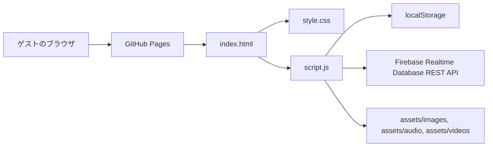
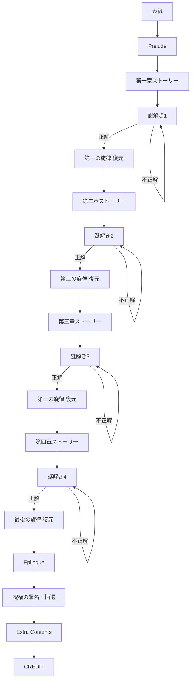

# 基本設計書

## システム概要

本システムは、結婚式ゲスト向けの静的Web謎解きサイトである。`index.html` 上の `#book` に対して、`script.js` が `pages` 配列と進行状態をもとにHTMLを生成し、画面を切り替える。

## システム構成

## 技術スタック一覧

| 項目 | 内容 |
| --- | --- |
| フロントエンド | HTML / CSS / JavaScript |
| SPA風画面切替 | JavaScriptによるDOM再描画 |
| 状態保存 | localStorage |
| 外部DB | Firebase Realtime Database |
| DB通信 | fetchによるREST API |
| 配信 | GitHub Pages |
| フォント | Google Fonts |
| ビルド | なし |

React、Vite、TypeScript、JSX、npm依存関係はコード上では確認できない。

## 動作環境

- スマートフォン縦画面を主対象
- PCブラウザにも対応
- 音声再生はブラウザの自動再生制限を受ける
- JavaScript、localStorage、fetchが利用できるブラウザが必要

## ディレクトリ構成

| パス | 役割 |
| --- | --- |
| `index.html` | アプリのHTMLエントリポイント |
| `style.css` | 全画面のスタイル、レスポンシブ、演出 |
| `script.js` | ページデータ、画面描画、進行管理、Firebase通信、音声制御 |
| `firebaseConfig.js` | Firebase Realtime Database URL設定 |
| `firebaseConfig.example.js` | Firebase設定例 |
| `README.md` | 公開サイト概要とFirebaseルール例 |
| `assets/images/` | 背景、問題画像、手紙、蝶など |
| `assets/audio/` | BGM、効果音 |
| `assets/videos/` | Extra Contents用動画 |
| `assets/audio/bk/` | バックアップ音源。`.gitignore`対象 |

`src/`、`public/`、`.github/workflows/` はリポジトリ内では確認できない。

## 画面一覧

| 画面 | 実装上のtype | 目的 |
| --- | --- | --- |
| 表紙 | `cover` | 導入、開始 |
| ストーリー | `story` | 章・エピローグ本文表示 |
| 謎前ストーリー | `puzzle-story` | 各謎の前段ストーリーと旋律一覧表示 |
| 謎解き | `puzzle` | 問題文、画像、回答入力 |
| 復元 | `restore` | 正解後の演出文表示 |
| エンディング | `ending` | 完成した旋律とメッセージ表示 |
| 祝福の署名 | `miracle` | 抽選参加、署名登録、署名一覧 |
| Extra Contents | `extra` | 外部ゲームリンク、動画、CREDIT |
| CREDIT | オーバーレイ | クレジット表示 |
| 封印ページ | 内部表示 | 未解放ページアクセス時の表示 |

## 画面遷移

## ユーザーフロー

- 初回アクセス時は表紙を表示
- 「祝福の館へ入る」で次ページを解放
- 「次のページへ」「謎へ進む」で進行
- 謎解きは正解時のみ復元ページへ進行
- 不正解時はエラーメッセージを表示
- 進行状況はlocalStorageに保存
- エピローグ後に抽選参加、署名、Extra Contentsが利用可能

## 機能一覧

- 画面描画
- ページ解放管理
- 正解判定
- 回答入力のカタカナ正規化
- 旋律一覧表示
- localStorage保存・復元
- Firebase署名登録・一覧取得
- Firebase抽選登録・参加人数表示
- 音声再生・停止
- CREDITオーバーレイ
- 動画表示
- レスポンシブ表示

## コンポーネント構成

Reactコンポーネントは存在しない。JavaScript関数が画面部品をHTML文字列として生成する構成。

主な描画関数は `renderCoverPage`、`renderStoryPage`、`renderPuzzleStoryPage`、`renderPuzzlePage`、`renderRestorePage`、`renderMiraclePage`、`renderExtraPage`。

## データの保存先

| データ | 保存先 |
| --- | --- |
| 進行状況 | localStorage `lostInvitationProgress` |
| ローカル署名 | localStorage `butterflyMiracleRecords` |
| 抽選参加済み情報 | localStorage `butterflyLotteryEntry` |
| ローカル抽選確認用 | localStorage `butterflyLotteryEntryList` |
| 共有署名 | Firebase `/butterflyMiracleRecords` |
| 抽選参加 | Firebase `/lotteryEntries` |

## 外部サービスとの連携

- Firebase Realtime Database
- Google Fonts
- 脱出ゲームメーカー外部リンク
- GitHub Pages

## アセット管理

画像、音声、動画は `assets/` 配下に配置され、相対パスで参照される。音声は `audioPaths`、蝶画像は `imagePaths`、問題画像は `pages` 配列内で管理される。

## レスポンシブ対応

CSSのメディアクエリ、`100dvh`、スクロール判定、`orientationchange` イベントによりスマートフォン表示へ対応している。

## エラー発生時の基本動作

- 不正解: 問題ページ内にエラーメッセージを表示
- 署名保存失敗: 再試行と再読み込みを促すメッセージ
- 抽選受付失敗: 再試行と再読み込みを促すメッセージ
- 署名一覧取得失敗: 読み込み失敗メッセージ
- 画像読み込み失敗: 対象画像を削除し、欠落クラスを付与
- 音声再生失敗: `catch` で握りつぶし、画面操作は継続

## デプロイ構成

GitHub Pagesで静的配信する構成。GitHub Actionsは確認できない。ビルド成果物の生成処理も確認できない。

## セキュリティ上の注意点

- Firebase Realtime Database URLはフロントから参照される
- APIキーはリポジトリ内では確認できない
- 署名ニックネームは `escapeHtml` でHTML実行を防止
- Firebaseルール実体はリポジトリ内では確認できない
- 抽選参加や署名は公開フォームであるため、荒らし対策・期間限定ルール設定が必要
