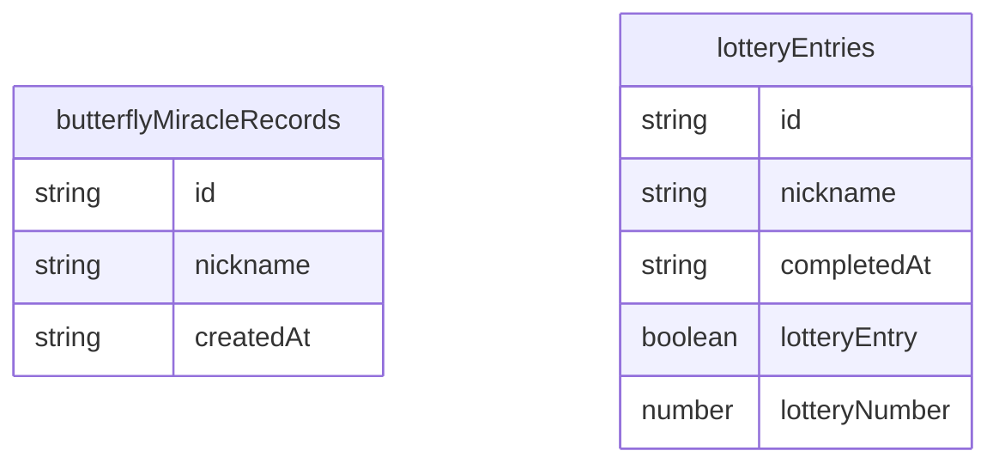

# DB設計書

## 使用しているデータベース

Firebase Realtime Databaseを使用している。Firestoreはコード上では確認できない。

接続先は `firebaseConfig.js` の `window.WEDDING_FIREBASE_CONFIG.databaseURL` で設定される。実URLは環境依存情報のため本書には記載しない。

## データベースの用途

- エピローグ後の署名一覧を全ユーザーで共有する
- プレゼント抽選参加情報を保存する
- 抽選参加人数を表示する

Firebase未設定時はlocalStorageへ保存する確認用モードが存在する。

## ノード構成

## データ項目一覧

| データパス | 項目名 | 型 | 必須 | 説明 | 登録・更新タイミング |
| --- | --- | --- | --- | --- | --- |
| `/butterflyMiracleRecords/{pushId}` | `id` | string | 必須 | クライアント生成ID | 署名登録時 |
| `/butterflyMiracleRecords/{pushId}` | `nickname` | string | 必須 | 署名ニックネーム。最大20文字 | 署名登録時 |
| `/butterflyMiracleRecords/{pushId}` | `createdAt` | string | 必須 | ISO形式日時 | 署名登録時 |
| `/lotteryEntries/{entryId}` | `id` | string | 必須 | クライアント生成ID | 抽選参加時 |
| `/lotteryEntries/{entryId}` | `nickname` | string | 任意 | 署名後に抽選データへ補完される場合あり | 抽選参加時、署名後PATCH |
| `/lotteryEntries/{entryId}` | `completedAt` | string | 必須 | ISO形式日時 | 抽選参加時 |
| `/lotteryEntries/{entryId}` | `lotteryEntry` | boolean | 必須 | 抽選参加フラグ | 抽選参加時 |
| `/lotteryEntries/{entryId}` | `lotteryNumber` | number | 必須 | 抽選番号 | 抽選参加時 |

## 初期値

Firebase側の初期データはコード上では確認できない。空データの場合、署名一覧は「まだ署名はありません。」、抽選人数は0名相当として表示される。

## 登録タイミング

- 署名: 「署名する」押下時
- 抽選: 「抽選へ参加する」押下時
- 抽選ニックネーム補完: 署名成功後、同一端末の抽選データにニックネームがない場合

## 更新タイミング

- 署名一覧: 初回表示、署名成功後、15秒間隔のポーリング
- 抽選人数: 抽選ページ表示時、抽選参加後
- 抽選ニックネーム: 署名後にPATCH

## 参照タイミング

- 署名一覧表示時に `/butterflyMiracleRecords.json` をGET
- 抽選人数表示時に `/lotteryEntries.json` をGET
- 抽選番号予約時に `/lotteryEntries/number-{number}.json` をGET/PUT

## バリデーション

クライアント側:

- 署名ニックネームは空欄不可
- 前後空白を削除
- 最大20文字
- 表示時にHTMLエスケープ

READMEにFirebaseルール例があるが、実際にFirebaseへ適用されているルールはリポジトリ内では確認できない。

## 並び順

- 署名一覧: `createdAt` の昇順
- 抽選一覧: `completedAt` の昇順

## 重複制御

- 署名: 同一端末から複数登録可能
- 抽選: localStorage `butterflyLotteryEntry` により同一端末の二重送信を抑制
- 抽選番号: `number-{lotteryNumber}` ノードへ空き番号を予約する方式。ただしFirebaseルールや同時実行条件により完全な原子的保証は要確認

## エラー時の挙動

| 処理 | エラー時 |
| --- | --- |
| 署名保存 | 失敗メッセージを表示 |
| 署名取得 | 失敗メッセージを表示 |
| 抽選受付 | 失敗メッセージを表示し、ボタンを再有効化 |
| 抽選人数取得 | ローカル件数または取得失敗メッセージを表示 |
| Firebase未設定 | localStorage保存へフォールバック |

## セキュリティルール上の注意点

- READMEのルール例は存在するが、実環境へ適用済みかは確認できない
- 入力者制限やレート制限はコード上では確認できない
- 公開サイトから書き込み可能なDBであるため、イベント期間のみ書き込み許可する運用が望ましい
- `lotteryEntries` は抽選運用に関わるため、不正書き込みへの対策が必要

## 個人情報・入力値の取り扱い

保存されるユーザー入力はニックネームのみ。氏名、メールアドレス、電話番号などの収集はコード上では確認できない。

ただし、ニックネームでも個人を識別できる可能性があるため、公開範囲と保存期間は要確認。
